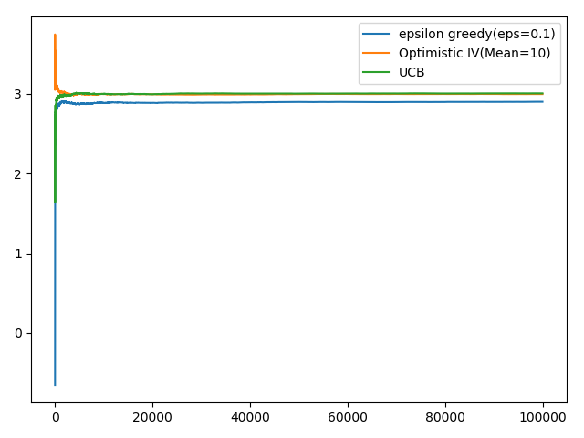

# Reinforcement learning:
	Learn what action to take in a state(policy) through reward function.  

## Main Charactersistics:  
1. Trial and error search
2. Delayed rewards

## How is it different from other ML algorithms?

Key difference:

	1. Explore and exploitation.  
	2. Learn at the same time maximize rewards
	
Supervised Learning:

	1. Learning from trained examples provided by a supervisor. Classify/extraoplate.  
	2. But in learning from interaction(RL), impossible to know all possible situation/representation.  

Unsupervised Learning:<br/>
	
	1. Finds patterns in the problem whereas RL learns howto maximize rewards.

Evolutionary vs learning from value function:
	  
	1. Evolutionary: Rewards are given only at the end of the step.  
	2. Value functions: Learns from each step.

## Components of RL:
**Policy**: What action to take in state.<br/>
**Rewards**: Response which the system gets for performing a action on a state(intrinsic desirablity of a state)<br/>
**Value function**: Long term desirablity of states (total reward accumulated over future from start to goal) actions are chosen which maximizes the value and not the immediate rewards.<br/>
**Model**:Based on the action performed on the current state, resultant states will be predicted.<br/>

## Multi arm bandit problem:
*Given a slot machine with n arms and each arm has its own probablity distribution of success. Pulling any one of it will give a stochastic reward. The objective is to collect maximum reward in the long run.*


<ins>For Example</ins>:  
Consider a 3 arm bandit problem. When you are starting you dont know which one gives the maximum reward. So, you need to pull all of them atleast once to know the reward of it. 
But the rewards are stochastic, so from one trial it's not possible to estimate the rewards.  
 
<ins>**Traditional method of solving**</ins>:
Pull all the arms to a fixed number of times and get an statistical inference.  
<ins>**Problems**</ins>:  
*How to determine the number of times to pull?  
*Keeping the n-high will result in less rewards in long run because we would have pulled the arms with less rewards and high rewards equally for most of the times. Not the best strategy.  
*Keeping the n-low , estimation might go wrong.

<ins>**RL Strategies**</ins>:  
**Epsilon greedy**:  

* In this strategy , we will choose the best arm(exploit) based on the (mean of rewards) for most of the times, but at the same times we also randomly choose other arms to (explore) the possibilities.  
* When to explore and when to exploit is decided by the epsilon value.  
Example:  
Number of trials = 100 epsilon = 10    
Then it means that , choose the best arm(exploit) 90% of times and randomly choose the arm(10%) of times.  
So, for each arm mean of rewards should be calculated at each instance.  
**Shortcut**:  
* Instead of storing all the rewards, calculate the mean each and every time and store in a variable. Using that, mean can be calculated easily.  


## Python implementation  
### Bandit class
``` python
"""Bandit class models the functionality of bandit. It has 2 methods pull and update """
class Bandit:
    # Initialize the variables
    def __init__(self,v):
        self.value=v
        self.mean=0
        self.N=0

    def pull(self):
        # Returns the value which is a gaussian with unit variance
        return np.random.randn()+self.value

    def update(self, x):
        # Calculate the new mean based on the previous estimates 
        self.N+=1
        self.mean=((((self.N-1.0)/self.N)*self.mean)+1.0 / self.N * x)
```

### Epsilon greedy implementation  
``` python
    for i in range(trials):
        # Generate a random number between 0 and 1
        choice=np.random.random()

        if choice<eps: 
            j= np.random.choice(3)
        else:
            j=np.argmax([b.mean for b in bandit])
        x=bandit[j].pull()
        bandit[j].update(x)
```

#### Explanation:
1. If the choice is less than epsilon , choose an arm in random(explore) whereas if the choice is greater than epsilon, choose the arm which has the current best estimate for reward(exploit). 
2. Then pull the arm and update the estimates.

### Comparison of different epsilons:  
In this experiment , I have created a bandit with three different arms having rewards as 1, 2, 3.  
The plot below shows the cumulative mean for 100000 trials.  

  

#### Explanation
1. For eps = 0.1 -> 90% of time choose the best action(exploit) and 10 % explore. Eventhogh it takes time to estimate the best action. It gives good rewards long run.
2. For eps = 0.5 -> 50% exploit and 50 %explore. So, not able to maximize the rewards completely as half of the time, does exploration.
3. For eps = 0.8 -> 20% exploit and 80 %explore. Not the best strategy.

### Optimistic initial values:  
1. Instead of assigning the initial estimate of mean to be zero, assign a value higher than the normal value.
2. And perform only the greedy selection.
3. So, once a particular arm is selected, the estimated mean will go down as the actual mean is much lower than the optimistic one. So, in the next step, other arms are chosen as their mean is still high.  
4. This method gives a better estimation as it executes all the actions several times in the initial stages itself. This is how explore-exploitation is achieved in this.
5. The image below shows the action selection when mean is set high(10) but the actual mean of the three arms are 1,2,3 respectively.
6. The arrow mark shows the arm which is selected.

 

## Implementation
``` python
    for i in range(trials):
        j=np.argmax([b.mean for b in bandit])
        x=bandit[j].pull()
        bandit[j].update(x)
        data[i]=x
```
## Explanation:  
Always choose the best action(greedy)

## Comparison:


## Explanation:  
1. You can see that that OIV performs better than epsilon greedy.
2. I have plotted for 2 different optimistic mean(5 and 10). 
3. So, if the number of trials are large enough, both of them converges. So, only criteria is that the mean should be optimistic(more than actual0

### Upper Confidence bound:  
1. The confidence of the estimate from 10 samples will be much lesser than confidence of estimate from 100 samples.
2. Key: The confidence exponentially increases with number of trials.


3. So, the confidence is a ratio between, total number of trials(N) and number of times that particular arm(Nj) is chosen.
4. If Nj is smaller , the ratio will be more, so, this arm will be chosen to estimate the correct value of it.
5. Eventually, when all the arms are played enough number of times, the ratio shrinks(Because numerator is log and denominator is normal) and will becomes a normal greedy strategy.
6. This ratio should added to mean and then the arm should be chosen based on the resulting value.

## Implementation:  

``` python
def run_experiment_ucb(bandit,trials):
    # Function to simulate the experiment
    data=np.empty(trials)

    # Epsilon greedy implememtation
    for i in range(trials):
        # Generate a random number between 0 and 1
        j=np.argmax([b.mean+np.sqrt(2.0*(np.log(i+1))/(b.N+0.01)) for b in bandit])
        x=bandit[j].pull()
        bandit[j].update(x)
        data[i]=x

    # Calculate the cumulative average
    cum_avg=np.cumsum(data)/(np.arange(trials)+1)

    return cum_avg

```
## Comparison:



## Explanation:

From the plot, you can see that it out performs epsilon greedy but almost the same as OIV.

## How to make the epsilon greedy work better?  
1. We need to explore more in the beginning and eventually we should decrease, as we will be getting closer to the true estimate. So, epsilon is inversely proportional to number of trials.
2. So make epsilon = 1/N.

## Comparison:

")


## Non stationary bandits:
1. Stationary - Statistics constant(Ex:Mean)
2. Weak sense stationary - Only mean and autocovariance constant
3. Strong sense sttionary - entire probablity distribution function remains constant
4. What if the PDF of our bandit changes(non-stationary). How to address this?

** Normal mean update: **


** Rearrange: **


** Replace 1/t with learning rate alpha**


** Low pass filter **

## Explanation:
* This is similar to low pass filter formula. Giving more emphasis on the current estimate and less for the past ones.

** Remove Recurrence **


### Doubts:Revisit the section


## New Components in the system:
** Episodes: ** One complete run of the game
** Terminal state: ** It's a state from which you cann't take anymore action , end of the episode.

## Deeper look into rewards:  
** Maze solving game **
1. Assign zero as reward for each step and 1 when it finds the exit.
2. Assign -1 as reward for each step and 1 whne it finds the exit.  
** Which is better? **  
The method 2 is better because each step is going to reduce the total reward. So, it will try to find the solution in minimum steps.  
But in method 1, taking a step is not going to affect the maximum reward, so it won,t result in an optimized strategy.
3. Don't bias the agent. The agent should learn the strategy on its own from the environment.  
4. * Say the agent what to achieve but not how to achieve it *

** Credit assignment problem **  
For example: If you have an exam tommorrow and you are preparing for it and then you perform well in the exam. But which action helped you to perform well in the exam. How will you assign reward/credit to it. It's very hard.
* RL way: Instead of considering a single action, entire sequence of action is considered.
